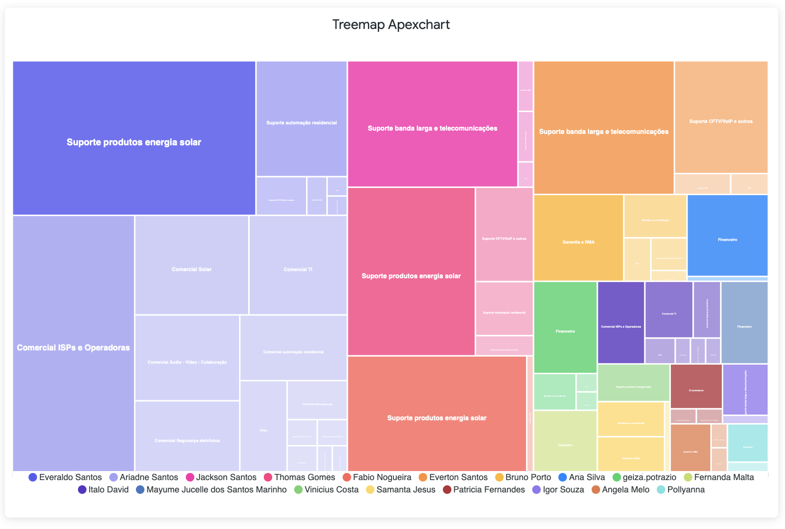
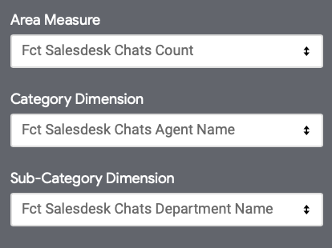
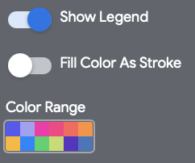

# Treemap Apexchart
This Looker treemap visualization was built using the Apexchart library.

---
## Looker Installation
1. Go to Admin > Platform > Visualizations.
2. Click on "Add Visualization".
3. Into the ID field, set the ID: "treemap_apexchart".
4. Into the Label field, set the Label as you want: "Tremap Apexchart".
5. Set the URL into the Main field: https://cdn.jsdelivr.net/gh/yadderace/looker_custom_viz@main/treemap/treemap_apexchart.js
6. Click on "Advanced Options" and add the dependecy: https://cdn.jsdelivr.net/npm/apexcharts
7. Click on Save.
---
## Configurations

### Data

#### Area Measure
You can select the measure that will represent the area on the treemap.

#### Category
You can create your treemap using just one dimension (Category) and one measure or table calculation.

####  Subcategory
You can create your treemap using two dimensions (Category and Sub-Category) and one measure or table calculation.

### Plot

#### Show/Hide Legend
You can show the legend ONLY when you create a Multidimensional treemap.

#### Fill Color As Stroke
You can fill with color the spaces between areas.

#### Color Range
You can select the range of color to use for the treemap.

---
## References
1. [Apexchart](https://apexcharts.com)
